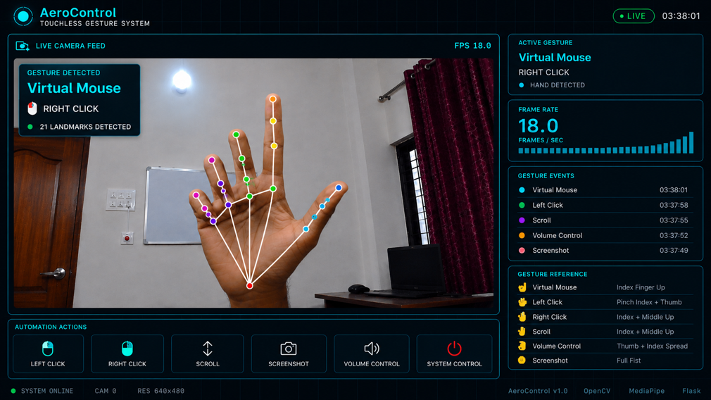

# 🚀 AeroControl – AI-Based Touchless Gesture Control System

An AI-powered touchless gesture control system that enables users to control computer functions using real-time hand gestures through a webcam.

---

## 📌 Project Overview

AeroControl uses Computer Vision and Artificial Intelligence to recognize hand gestures and perform system operations such as:

- 🖱️ Virtual Mouse
- 👆 Left Click
- 👉 Right Click
- ↕️ Scroll
- 🔊 Volume Control
- 📸 Screenshot Capture

---

## 🛠️ Technologies Used

- Python
- OpenCV
- MediaPipe
- Flask
- PyAutoGUI
- Computer Vision

---

## ✨ Features

- Real-time Hand Detection
- 21 Hand Landmark Tracking
- AI-Based Gesture Recognition
- Live Dashboard
- Touchless Computer Control
- FPS Monitoring
- Screenshot Automation

---

## 🖼️ Project Screenshots

### Dashboard



---

### Gesture Guide


---

### Hand Landmark Detection


---

### System Architecture


### Dashboard

(Add your dashboard image here after uploading it to the images folder.)

### Gesture Reference

(Add your gesture guide image here.)

### Hand Landmark Detection

(Add your landmark image here.)

### System Architecture

(Add your architecture diagram here.)

---

## 📂 Project Structure

```
AeroControl/
│
├── app.py
├── main.py
├── gesture_controller.py
├── hand_tracking.py
├── screenshot.py
├── volume_control.py
├── utils.py
├── requirements.txt
├── frontend/
├── assets/
└── images/
```

---

## ⚙️ Installation

```bash
git clone https://github.com/kadhirezhiland/AeroControl.git
cd AeroControl
pip install -r requirements.txt
python app.py
```

---

## 🎯 Future Improvements

- Voice Commands
- Custom Gesture Training
- Multi-Hand Tracking
- AI Gesture Learning
- IoT Device Integration

---

## 👨‍💻 Author

**Kadhirezhilan**

Computer Science Engineering Student

Aspiring AI Engineer
